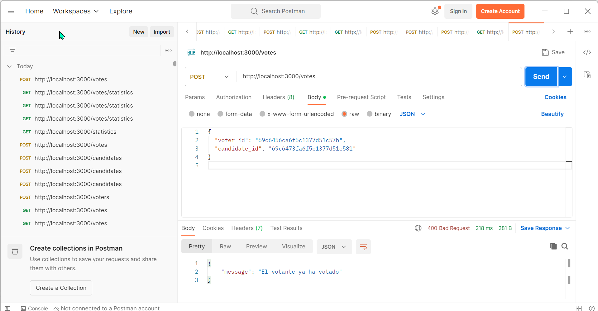
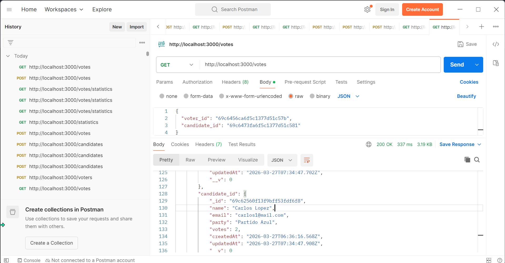
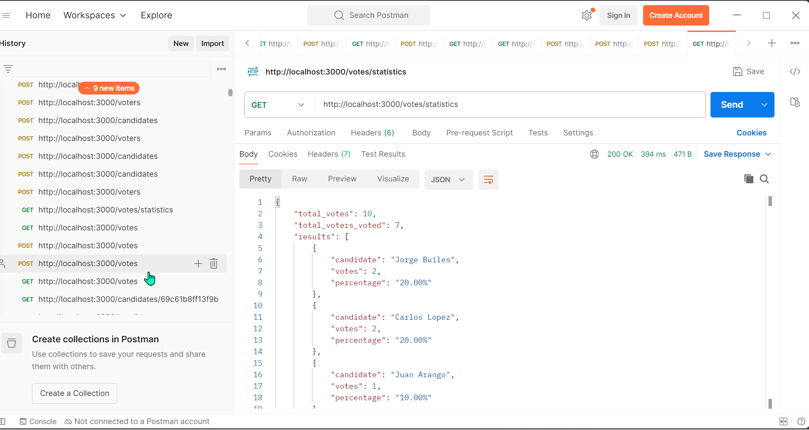

# 🗳️ Sistema de Votación - API REST

## Descripción

API REST desarrollada con Node.js, Express y MongoDB que permite gestionar votantes, candidatos y votos, incluyendo estadísticas de la votación.


## Instalación y ejecución

1. Clonar repositorio:

```bash
git clone https://github.com/JorgeBuiles/prueba-tecnica-votacion.git
cd prueba-tecnica-votacion
```

2. Instalar dependencias:

```bash
npm install
```

3. Ejecutar servidor:

```bash
npm run dev
```

Servidor en:

```
http://localhost:3000
```


## Ejemplos de uso (Postman)


### Crear votante

POST /voters

Request:
{
  "name": "Jorge Elias Builes",
  "email": "jorgeeliasb@mail.com"
}

Response:
{
    "name": "Jorge Elias Builes",
    "email": "jorgeeliasb@mail.com",
    "has_voted": false,
    "_id": "69c6456ca6f5c1377d51c57b",
    "createdAt": "2026-03-27T08:53:00.973Z",
    "updatedAt": "2026-03-27T08:53:00.973Z",
    "__v": 0
}

### Crear candidato

POST /candidates

Request:
{
  "name": "Juan Arango",
  "email": "arangoj@mail.com",
  "party": "Partido Verde"
}

Response:
{
    "name": "Juan Arango",
    "email": "arangoj@mail.com",
    "party": "Partido Verde",
    "votes": 0,
    "_id": "69c6473fa6f5c1377d51c581",
    "createdAt": "2026-03-27T09:00:47.905Z",
    "updatedAt": "2026-03-27T09:00:47.905Z",
    "__v": 0
}


### Registrar voto

Request:
{
  "voter_id": "69c6456ca6f5c1377d51c57b",
  "candidate_id": "69c6473fa6f5c1377d51c581"
}


Response:
{
  "message": "Voto registrado correctamente"
}


### Ver estadisticas

Response:
{
    "total_votes": 10,
    "total_voters_voted": 7,
    "results": [
        {
            "candidate": "Jorge Builes",
            "votes": 2,
            "percentage": "20.00%"
        },
        {
            "candidate": "Carlos Lopez",
            "votes": 2,
            "percentage": "20.00%"
        },
        {
            "candidate": "Juan Arango",
            "votes": 1,
            "percentage": "10.00%"
        }
    ]
}


## Capturas

### Registro de voto


### Lista de votos


### Estadísticas



## Validaciones implementadas

* Un votante solo puede votar una vez
* Validación de IDs
* Validación de campos obligatorios
* Email único en votantes
* Un votante no puede ser candidato y viceversa


## Pruebas

Probado con Postman.


## 👨‍💻 Autor

Jorge Builes
